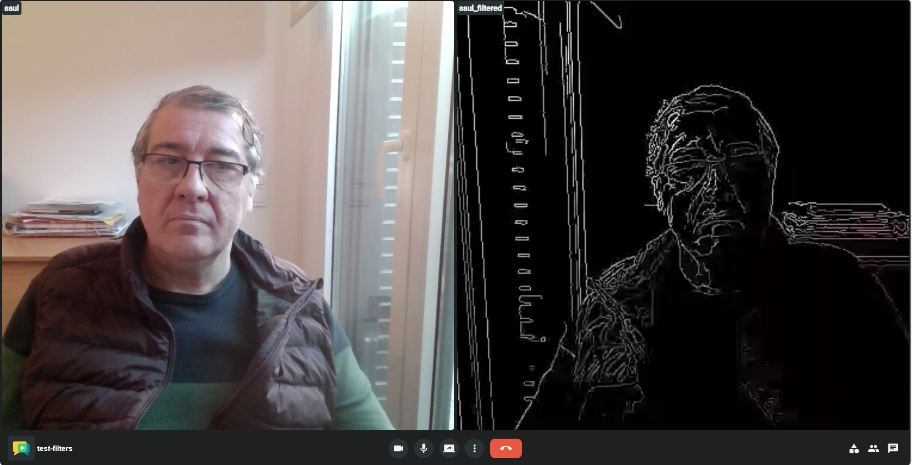
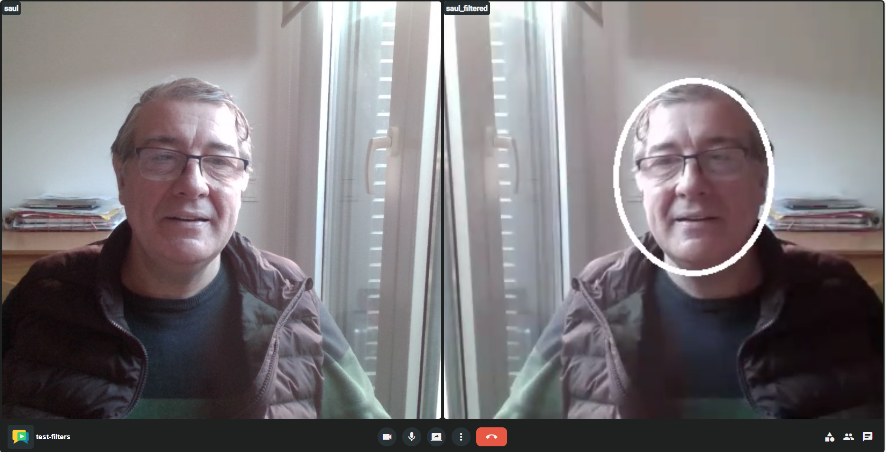

# OpenVidu3-Kurento

This repository contains the components to integrate [OpenVidu 3](https://openvidu.io) with [Kurento](https://kurento.openvidu.io), the main objective is to provide the capability of adding media processing capabilities to OpenVidu via Kurento. The first goal is to provide a migration of the OpenVidu filtering API to OpenVidu 3.

This project consists basically of two elements:
 - OV3Endpoint, a Kurento endpoint that allows to publish and subscribe streams from OpenVidu 3 sessions
 - REST API, this is a REST API that allows to add filtering to an existent participant on an OpenVidu 3 sessions. This REST API implements a model much like the usual OpenVidu 2.x filtering feature, including the same features:
   - Initialization of Kurento filter to apply
   - Execute methods on the filter
   - Receive event from the filter using a webhook

## For the impatient
To quickly try this service just do the following:
- Start an OpenVidu 3 service and collect URL to connect to that openvidu server and credentials (OpenVidu 3 API key and OpenVidu 3 secret)
- configure the previous parameters on `docker/.env`file:
  - On `OV3_URL`set the URL to access to OpenVidu 3 server
  - On `OV3_SECRET` set the secret from OpenVidu 3
  - On `OV3_APIKEY`set the key from OpenVidu 3
- Launch the service, just do the following:
```console
cd docker
docker compose up -d
```
Wait a little the first time, because compiling docker images can take some time on first run.

Now if you start a session on the OpenVidu 3 service and some participant joins, a filter can be applied by issuing the corresponding REST API (take that roomId is `test-filter`and participantID `user`)
```console
curl -X POST "http://localhost:8080/v1/ov3/filter/test-filter/user" -H "accept: */*" -H "Content-Type: application/json" -d "{ \"filterOptions\": \"{\\\"command\\\":\\\"edgedetect\\\"}\", \"filterType\": \"GStreamerFilter\"}"
```
You can also use the swagger gui on `http://localhost:8080/swagger-ui.html`for simplicity.

You should see in the same room a new participant with the result of the participant media filtered according to the specified command:



Also, removing the subscription is done easily byt issuing the REST DELETE API

```console
curl -X DELETE "http://localhost:8080/v1/ov3/filter/test-filter/user" -H "accept: */*"
```

You can play trying different filters like `facedetect` this way:
```console
curl -X POST "http://localhost:8080/v1/ov3/filter/test-filter/user" -H "accept: */*" -H "Content-Type: application/json" -d "{ \"filterOptions\": \"{\\\"command\\\":\\\"facedetect\\\"}\", \"filterType\": \"GStreamerFilter\"}"
```



## Ov3Endpoint
This is a Kurento module: ov3endpoint. This module provides two elements:
- Ov3Subscriber. This element allows joining to an existent OpenVidu 3 session and subscribe to a participant stream with real time and low latency capabilities.
- Ov3Publisher. This elements allows joining to an existent OpenVidu 3 session to publish some media stream like any other participant stream. Again with real time and low latency capabilities.

### Ov3Subscriber

This elements subscribes audio and video from a participant in an OpenVidu 3 session. It uses the standard golang API to subscribe to participant's tracks and translates them to Kureot/GStreamer media flows that are then inserted on a Kurento Pipeline. The component reuses OpenVIdu 3 connection whenever possible. so that if many subscriptions are made to the same session a single connection is used.

It features the follwing methods:
- `Constructor`, builds a subscriber with the information to connect to the session and participant:
  - `url`it is the URL of the OpenVidu 3 service
  - `secret`secret part of the credential to access OpenVidu 3 service
  - `key`key part of the credential to access OpenVidu 3 service.
- `subscribeParticipant`subscribes to the media of a participant in a session. it uses the following parameters:
  - `room`identifier of the room where the participant to subscribe is joined
  - `participant`idnetifier of the participant to subcribe to
  - `screenshare` `false`if main video is to be subscribed, `true`if screenshare is to be subscribed
 
### Ov3Publisher

This elements publishes audio and video to an OpenVidu 3 session. It uses the standard golang API to publish media that is got form media flows in a Kurento/GStreamer pipeline. 

It features the follwing methods:
- `Constructor`, builds a subscriber with the information to connect to the session and participant:
  - `url`it is the URL of the OpenVidu 3 service
  - `secret`secret part of the credential to access OpenVidu 3 service
  - `key`key part of the credential to access OpenVidu 3 service.
  - `room` room Id where media should be published
  - `participantId` Identifier for the published participant, it should not be the same of any other participant on the room
  - `participantName` name to be published for the participant.
  - `screenshare` `false` if the media published should be identified as main video, `true` if it should be identified as an screenshare
- `publishParticipant` publishes a participant media in a session. it uses the following parameters:
  - `publishAudio` `true`if it should publish audio
  - `publishVideo` `true` if it shoudl publish video`
 


### Building
Pre-requisites
- You need to access kurento ci scripts, specifically [kurento-buildpackage.sh](https://github.com/Kurento/kurento/blob/7.1.1/ci-scripts/kurento-buildpackage.sh) script. This is needed to build the .deb adrtifact for the module
- [GoLang](https://go.dev/) this is needed to build the go parts of the module.

For building the artifact, just type:
```sh
kurento-buildpackage --release
```
Then you can deploy it over a Kurento 7.x installation just by executing:
```sh
apt install -y ov3endpoint_1.0.0ubuntu1_amd64.deb
```
Or if you want to build a docker image just issue:
```sh
cd docker/kurento
docker build -t kurento/kurento-media-server:7.1.1-ov3 .
```


## REST API
This is a REST API server based on Springboot that implements the filtering feature as found on [OpenVidu 2.x](https://docs.openvidu.io/en/stable/advanced-features/filters/)

### Add a filter to a participant
```console
POST /v1/ov3/filter/{roomId}/{participantId}
```

Body
```json
{
  "filterOptions": "string",
  "filterType": "string"
}
```

This API subscribes to participant with id `participantId` in an OpenVidu 3 session with identifier `roomId`. Then the media stream subscribed is applied a filter, that filter applied is set on the JSON on the body with the same semantics than on OpenVidu 2.x API: 
- `filterType` is the type of filter to apply that corresponds to an actual filter on the Kurento server, for example `GStreamerFilter`
- `filterOptions` are the parameters that will be applied to the constructor of the filter in JSON format, in the case of `GStreamerFilter`, it will be a JSON with just one string field called `command` that should contain the gstreamer command of the filter

The filtered stream will be published to the same room in OpenVidu 3 with a participant identifier built from the original ``participantId` as `<participantId>_filtered`

If the participant already has a filter in place, the API will fail with an error. To substitute a filter, the application must first remove the original filter and then apply a new one.

This API creates a simple Kurento pipeline that implements the filtering feature:
```console
                         +---------------+        +----------------+        +--------------+
OpenVidu3                |               |        |                |        |              |         OpenVidu3
  session     ---------->| Ov3Subscriber |------->|     Filter     |------->| Ov3Publisher |------>  session
                         |               |        |                |        |              |
                         +---------------+        +----------------+        +--------------+
```

### Remove  a filter for a participant
```console
DELETE /v1/ov3/filter/{roomId}/{participantId}
```

### Executes a method in a participant filter
```console
POST /v1/ov3/filter/{roomId}/{participantId}/exec
```

Body
```json
{
  "filterMethod": "string",
  "methodParams": "string"
}
```


This API executes a method on the Kurento filter that is setup for `particpantId` in `roomId`. Of course the method needs to be one of the methods that the Kurento filter defines on its interface.
The method to execute and parameters for its execution are set on the JSON on the body with the same semantics than on OpenVidu 2.x API: 
- `filterMethod` is the name of the method on the filter that corresponds to an actual method of the filter on the Kurento server.
- `methodParams` are the parameters that will be applied to the method of the filter in JSON format.

The result of the execution of the method will be immediately applied to the filtered stream that is published on the room

If no filter is applied or if the method set does not exist on the filter, an error will be raised.

### Subscription to filter events.
```console
GET /v1/ov3/filter/{roomId}/{participantId}/event/{event}
```

This API makes a subscription to the event idetified by `event` of the filter applied to the `participantId`on the `roomId`. This subscription menas that from the moment this subscription is made, whenever the filter raises an event, the server will issue a webhook with the event information.

The events will be delivered with a `POST` call to the following URL: `<webhook URL>/<sessionId>/<participantId>/<eventType>`, where
- `<webhooh URL>`is set on the configuration of the service (environment variable `FILTER_WEBHOOK`).
- `<sessionId>` and `<participantId>` identifies the participant whose filter is the one we want to receive events from.
- `<eventType>` is the name of the event the API is subscribing to.
The body of the `POST` call will carry the event parameteres in a JSON format.

### Remove subscription to a filter event
```console
DELETE /v1/ov3/filter/{roomId}/{participantId}/event/{event}
```

This API removes a previous subscription made to a certain event on the filter associated to `participantId` pn `roomId`.

### Configuration
The REST API server needs some configuration through some envuronment variables:
- `KURENTO_URL` This is the URL of the Kurento service to use, the Kurento service needs to have deployed the OV3Endpoint module, if using the docker compose script included this will allways be `ws://kurento:8888/kurento`
- `OV3_URL`URL of the OpenVidu 3 server.
- `OV3_SECRET` secret used to access the OpenVidu 3 server.
- `OV3_APIKEY` key used to acces the OpenVidur 3 server.
- `OV3_API_PASS` the filter REST API is protected by user and password, the user will always be `OV3FILTERSAPP`and the password is set here.
- `FILTER_WEBHOOK`This is the base URL where webhooks from filter events will be launched

### Building
Pre-requisites
- You need access to Java compiling environment
- Either you collect the Java client for the OV3Endpoint or you can compile for yourself just by getting the source of the project and executing the following script that will store the Java artifact in local maven repository.
```console
cmake -DCMAKE_BUILD_TYPE=Release -DGENERATE_JAVA_CLIENT_PROJECT=TRUE .
make maven_install
```

For building the artifact, just type:
```sh
cd rest
mvn clean compile package
```
Thus you will get on `rest/target/ov3-kurento-filters-1.0.0.jar` the springboot application that you can launch with 
```console
java -jar ov3-kurento-filters-1.0.0.jar
```